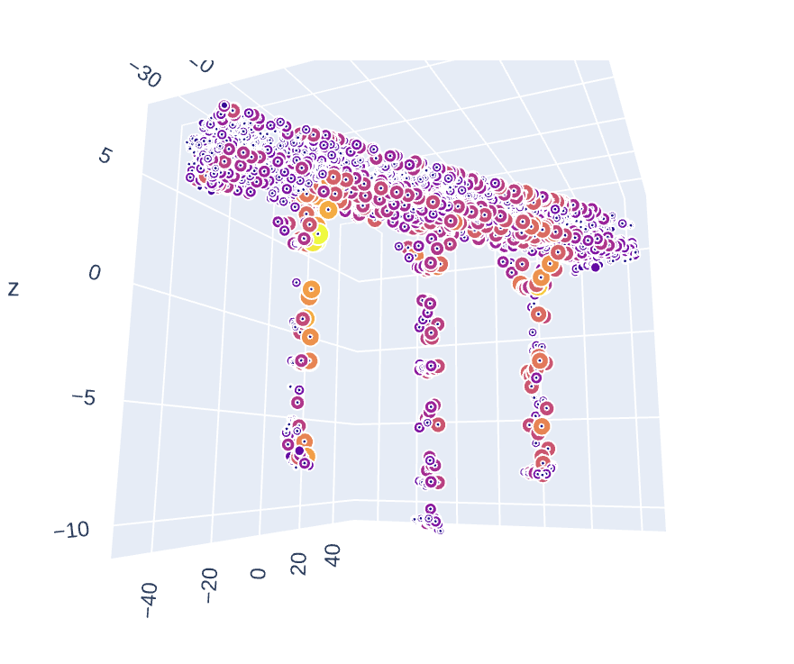
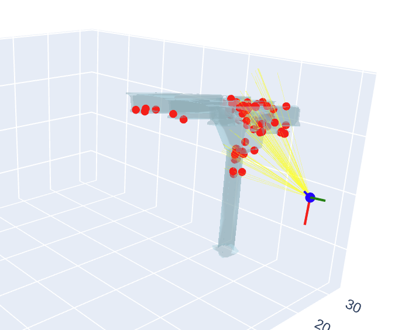

## Image selection

The goal of this project is to develop an algorithm that, given a set of drone-captured images of a bridge, determines the minimum number of images needed to fully visualize the structure. As the images overlap, the challenge lies in selecting a subset that provides complete coverage while prioritizing close-up images for detailed defect inspection.

Due to limitations in the visible point selection algorithm and available data, complete image coverage of the vertices was not achievable. Therefore, the optimization process focuses on maximizing coverage with a given number of images. Full coverage optimization is also implemented, but the current data set does not allow for its use.

## Data preparation 

Poses and camera files shoud be created with `create_poses_data.py` and `read_metashape_cameras_xml.py`,respectively. 
These files require the following paths.
- `create_poses_data.py`
  - `CAMERAS_XML_PATH`: camera info xml path
  - `OUTPUT_MAPPING_PATH`: output mapping json file
  - `OUTPUT_PATH`: output json, that will be `CAMERAS_PATH` file

-  `read_metashape_cameras_xml.py`
  - `MAPPING_PATH`: mapping json file
  - `OPHIKAPPA_POSES_PATH`: ophikappa_poses_centered.txt file
  - `OUTPUT_FOLDER_PATH`: output folder, that will be `POSES_FOLDER` file

Also data preparation can be run from the `demo.ipynb`

## Algorithm
The algorithm requires the following inputs:

- `IMG_FOLDER_PATH`: Path to the folder containing images
- `POSES_FOLDER`: Path to the folder containing pose data as JSON files
- `CAMERAS_PATH`: Path to the camera data JSON file
- `MESH_PATH`: Path to the mesh OBJ file

These paths must be specified in the `check_visibility.py` file

## Code
- `demo.ipynb` - main notebook with visualisation of vertices coverage, images selection algorithms and calculating coverage percentages

- `check_visibility.py`: This script contains functions for:
  - Loading camera and pose information from JSON files
  - Loading and preparing the mesh
  - Projecting mesh vertices onto the image plane
  - Filtering vertices based on camera view and image boundaries
  - Checking vertex visibility using ray tracing
  - Finding the indices of visible vertices in the original mesh

- `fixed_data_one_camera.ipynb`: Notebook demonstrating the development and functionality of the ray tracing algorithm, visualizing the rays and mesh

- `fixed_data.ipynb`: Same code as above, but stripped for reproducibility

- `mesh_utils.py' - script provides utility functions for working with meshes, including slicing a mesh based on camera view and creating image masks from meshes.●
- `visualisation.py' -  script contains functions for visualizing the results in 2D and 3D, including plotting the mesh, visible vertices, camera position, and rays.

## How to Run.
- Install the required libraries
- Execute `create_poses_data.py` and `read_metashape_cameras_xml.py` scripts to generate the pose and camera JSON files OR
generate data using second cell in `demo.ipynb`
- Run either the `demo.ipynb` or fixed_data.ipynb  notebook to execute the algorithm and visualize the results.

